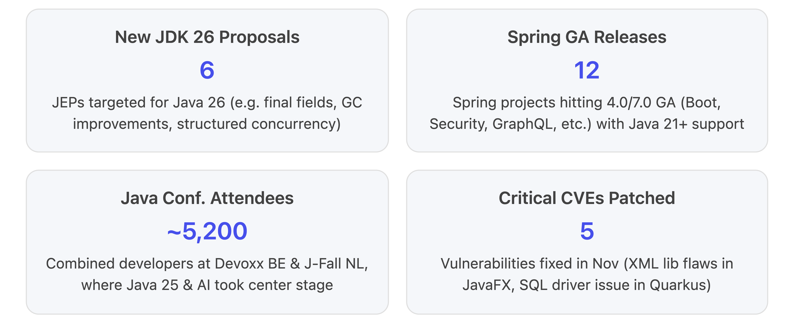
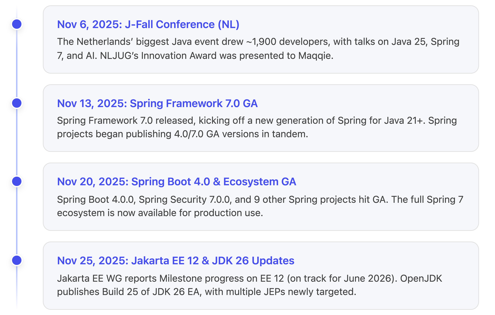

Great. I'll compile a detailed report now—this may take a couple of minutes, thank you for your patience.

# ☕ Pulse on Java – November 2025 Edition

*Your AI-generated monthly roundup of Java platform, framework, and community updates.*

**November 2025 was a landmark month for the Java ecosystem**, marked by the **general availability of Spring Framework 7.0 and Spring Boot 4.0**, early work on **Java’s next release (JDK 26)** with several new JEPs targeted, and vibrant community gatherings (Devoxx, J-Fall) highlighting Java 25’s impact and the rise of AI. Major vendors delivered updates – Oracle’s **October Critical Patch Update** (CPU) addressed multiple vulnerabilities, and open-source projects from **Jakarta EE to Quarkus** rolled out releases for security and stability. Below we break down the key developments in Java SE, enterprise frameworks, industry news, and more, with highlights of the most significant happenings first.

<!-- Copilot-Researcher-Visualization -->

### 🔬 **Java SE & Platform Updates**

**JDK 26 Takes Shape:** With Java 25 (LTS) now in wide use, attention turned to **JDK 26 development in November 2025**. Several **JDK Enhancement Proposals (JEPs)** were targeted for JDK 26, signaling the features likely to land in the March 2026 release. Notably, **JEP 500 “Prepare to Make Final Mean Final”** aims to strengthen Java’s `final` semantics (laying groundwork for value types by ensuring truly immutable fields and classes). The **G1 GC throughput improvements (JEP 522)** were slated to reduce synchronization overhead in garbage collection, and **JEP 516 “Ahead-of-Time Object Caching”** was proposed to cache pre-initialized objects for faster startup. We also saw continued iterations of preview features: **Structured Concurrency (6th Preview, JEP 525)** and **Lazy Static Constants (2nd Preview, JEP 526)**, which were re-targeted to JDK 26. Additionally, a second preview of **PEM Encodings for cryptographic keys (JEP 524)** is set to refine key handling APIs. All these indicate an emphasis on **performance, reliability, and gradual language evolution** – e.g. stricter `final` and enhanced concurrency control – in the next Java version. Developers are encouraged to **test early-access JDK 26 builds** and report issues, as the OpenJDK team rolls out weekly snapshots (Build 25 was available by late November). [\[blog.jetbrains.com\]](https://blog.jetbrains.com/idea/2025/12/java-annotated-monthly-december-2025/) [\[infoq.com\]](https://www.infoq.com/news/2025/11/java-news-roundup-nov17-2025/)

**Adoption of Java 25:** Two months after its release, **Java 25 (JDK 25)** is becoming mainstream. Red Hat announced **OpenJDK 25’s inclusion in Red Hat Enterprise Linux 10.1** (released in early December), ensuring enterprise users on RHEL can leverage Java 25’s performance and security enhancements out-of-the-box. Meanwhile, Oracle’s **October 2025 Critical Patch Update** – the quarterly security bundle – was applied to Java 25 and earlier LTS versions. This CPU fixed several vulnerabilities, including issues in Java’s XML processing libraries used by JavaFX (libxslt/libxml). For example, downstream JDK distributor BellSoft promptly **re-released Liberica JDK 25.0.1** (and updates for JDK 21, 17, 11, 8) to include patches for **four CVEs in libxslt/libxml** (CVE-2025-7424, -7425, -6021, -10911). These fixes address XML transformation and parsing flaws, underscoring Java’s continued focus on security hardening. **OpenJDK 25 itself remains stable** with only minor bugs reported; no “hotfix” releases were needed in November beyond the planned 25.0.1 security update. [\[infoq.com\]](https://www.infoq.com/news/2025/11/java-news-roundup-nov17-2025/)

**Jakarta EE & Enterprise Java:** Over at the Jakarta EE community, work is already underway for **Jakarta EE 12**, even as enterprises begin adopting **Jakarta EE 11 (released earlier in 2025)**. Eclipse Foundation advocate Ivar Grimstad reported that **Milestone 2 of Jakarta EE 12** was on track for a December 9 completion, keeping a mid-2026 GA release looking “promising”. A notable new initiative in EE 12 is the **Jakarta **Agentic Artificial Intelligence**** specification project, which was officially provisioned in November. This forthcoming spec has generated **“a lot of positive feedback from the community”** – it aims to standardize integration of AI/ML capabilities or agents in enterprise Java, reflecting the industry’s AI trend. Jakarta EE 12 will go through **four milestone builds before its final release in July 2026**, and will likely target Java 21+ environments. In the meantime, **Jakarta EE 11 adoption** is accelerating: IBM’s **Open Liberty** server delivered a **November beta (25.0.0.12)** that previews **Jakarta Data 1.1 (Milestone 1)** for EE 12. This means developers can experiment with an updated Jakarta Data (the EE counterpart to Spring Data) on Liberty ahead of EE 12. Open Liberty’s beta also added a new `springBoot-4.0` feature for **Spring Boot 4** compatibility – a timely update given Spring 7’s release – and enhanced its support for Helidon’s experimental MCP services (more on that below). These moves ensure that enterprise Java runtimes are ready for the **next wave of standards and frameworks**. [\[infoq.com\]](https://www.infoq.com/news/2025/11/java-news-roundup-nov17-2025/)

### 🚀 **Major Framework Releases & Ecosystem News**

#### **Spring Framework 7.0 & Spring Boot 4.0 Go GA (Next-Gen Spring)**

One of the biggest headlines in November was the **arrival of Spring Framework 7.0 and Spring Boot 4.0 as General Availability releases**. **Spring Framework 7.0** was released on November 13, the first major update to Spring Core since 2022. Just days later, on November 20, the Spring team delivered **Spring Boot 4.0.0 GA** (after three milestones and two RCs), along with a wave of coordinated releases across the Spring portfolio. **A total of 12 Spring projects reached their 4.0/7.0 GA versions** this month, inaugurating Spring’s new generation built for Java 21+ and Jakarta EE 11. These include Spring Framework 7.0, **Spring Boot 4.0**, **Spring Security 7.0**, **Spring for GraphQL 2.0**, **Spring Integration 7.0**, **Spring Modulith 2.0**, **Spring REST Docs 4.0**, **Spring Batch 6.0**, **Spring AMQP 4.0**, **Spring for Apache Kafka 4.0**, **Spring Web Services 5.0**, and **Spring Vault 4.0**. The releases were synchronized to ensure a consistent stack for developers moving to the new Spring era. [\[infoq.com\]](https://www.infoq.com/news/2025/11/spring-news-roundup-nov17-2025/) [\[infoq.com\]](https://www.infoq.com/news/2025/11/spring-news-roundup-nov17-2025/), [\[infoq.com\]](https://www.infoq.com/news/2025/11/spring-news-roundup-nov17-2025/)

**Key themes in Spring 7/Boot 4** are **modern Java baseline, modularization, and developer productivity**. All Spring 7 components now require **Java 21+ and Jakarta EE 11** APIs, dropping support for the older `javax.*` namespace. Spring Boot 4 itself has been fully **modularized**: the once-monolithic `spring-boot-autoconfigure` jar is now split into finer-grained modules (e.g. separate auto-configurations for Web MVC, JPA, Flyway, etc.), so applications can pull in only what they need. This can reduce startup time and memory by avoiding unused auto-config. Boot 4 also introduces built-in **API versioning support** for REST endpoints and upgrades to **Jackson 3.0** for JSON processing. Meanwhile, Spring Framework 7 brings features like **HTTP interface clients (@HttpServiceClient)** – a declarative HTTP client generator comparable to OpenFeign – which Spring Boot 4 auto-configures for any interface annotated with `@HttpServiceClient`. Spring 7’s core container saw **resilience enhancements** (e.g. built-in circuit breaker patterns), and many components embraced **JSpecify null-safety** annotations, improving Kotlin and static analysis support. There are also quality-of-life improvements such as **structured logging** built into Spring Boot (JSON log output for easier log aggregation) and a new **Fluent Authorization API** in Spring Security 7 for programmatic config of complex security rules. Notably, **Spring Authorization Server 1.1** added OAuth2 Device Code flow support, **Spring GraphQL 2.0** upgraded to GraphQL Java 25 and added subscription support, and **Spring Batch 6.0** introduced a new parallel chunking model for splitting batch steps across virtual threads. [\[blog.jetbrains.com\]](https://blog.jetbrains.com/idea/2025/12/java-annotated-monthly-december-2025/), [\[blog.jetbrains.com\]](https://blog.jetbrains.com/idea/2025/12/java-annotated-monthly-december-2025/) [\[blog.jetbrains.com\]](https://blog.jetbrains.com/idea/2025/12/java-annotated-monthly-december-2025/) [\[infoq.com\]](https://www.infoq.com/news/2025/11/spring-news-roundup-nov17-2025/), [\[infoq.com\]](https://www.infoq.com/news/2025/11/spring-news-roundup-nov17-2025/)

For enterprise developers, the update means the **Spring ecosystem is fully ready for the latest Java platform**. Early adopters can now run Spring applications on **JDK 25** with Jakarta EE 11 APIs seamlessly. The effort to upgrade from Spring 6.x/Boot 3.x to Spring 7/Boot 4 is expected to be smoother than the previous Spring 5→6 transition, as it’s largely removing deprecated APIs and switching to `jakarta.*` dependencies (most Spring Boot starters will handle this automatically). JetBrains noted that **IntelliJ IDEA 2025.3 added support for Spring 7 features** (like recognizing the new modular starters and configuration properties) to aid developers migrating their projects. Overall, this **“new generation of Spring”** will define enterprise Java development for years to come, bringing improvements in performance (thanks to virtual threads and Java 21 optimizations) and maintainability. [\[blog.jetbrains.com\]](https://blog.jetbrains.com/idea/2025/12/java-annotated-monthly-december-2025/)

#### **Other Frameworks & Libraries: Quarkus, Micronaut, Grails & More**

**Quarkus** – Red Hat’s Kubernetes-native Java framework – delivered important maintenance updates in November focused on security. **Quarkus 3.29.4** (and backports 3.27.1 and 3.20.4) were released to address a critical JDBC vulnerability. The flaw (tracked as **CVE-2025-59250**) allowed potential spoofing via unchecked input in the Microsoft SQL Server JDBC driver; Quarkus’s patches updated the driver and other dependencies to plug this hole. These releases also included miscellaneous bug fixes and library upgrades. The Quarkus team indicated that **Quarkus 3.27** is the final feature line for 3.x, to be designated an LTS with ongoing support, while development effort pivots to Quarkus 4. (**Quarkus 4**, expected in 2026, will target Java 21+ and Jakarta EE 11 exclusively, dropping legacy support.) Users are advised to **apply the 3.29.4/3.27.1 patch** if they use the vulnerable JDBC driver, and then plan migrations to the forthcoming Quarkus 4 for long-term stability. On the horizon, we anticipate Quarkus 4 will incorporate preview JDK 25/26 features (like virtual threads for all request handling) and align with the EE 11 APIs. [\[infoq.com\]](https://www.infoq.com/news/2025/11/java-news-roundup-nov17-2025/)

**Micronaut**, another popular JVM microservice framework, continued its steady cadence of releases. The **Micronaut 4.10.x** series saw **versions 4.10.1, 4.10.2, and 4.10.3** over late October to early December. These were incremental updates including bug fixes, dependency bumps, and minor improvements. For instance, **Micronaut 4.10.2 (Nov 13)** added some enhancements in Micronaut Data and Micronaut Serialization modules. While no major new features landed in 4.10, the Micronaut team is ensuring full compatibility with **Spring’s latest** (Micronaut 4 already supports Jakarta EE 10/11 baseline and JDK 21). Looking ahead, the Micronaut Foundation has signaled work on Micronaut 5 in 2026 to further optimize ahead-of-time compilation and GraalVM native integration, but in November the focus was on polishing the 4.x line for production usage.

The **Apache Groovy** ecosystem got a boost with **Grails 7.0** reaching GA. **Grails 7.0.0** was released under the Apache Software Foundation umbrella (Grails joined Apache as a top-level project), marking a new chapter for the veteran web framework. Grails 7.0 upgrades its engine to **Micronaut 4** under the hood and refreshes GORM (the Grails Object-Relational Mapping) for better performance. The release delivers improved integration with Micronaut and Spring, aligning Grails with modern conventions while retaining its rapid application development ethos. This is significant for organizations still running Grails apps – they now have a path to move onto an actively maintained, modern foundation. According to the Java roundup, Grails 7’s debut was *officially announced in late October* and highlighted as a major community milestone in early November. [\[javalang.com\]](https://javalang.com/2025/11/01/java-news-roundup-oracle-critical-patch-update-bellsoft-grails-hazelcast-langchain4j-103/)

In the **enterprise integration space**, **Apache Camel 4** continued with minor updates (Camel 4.14 was released in late October as noted in the prior Pulse). November didn’t bring a new Camel release, but its ecosystem is closely tracking Java 25 readiness – Camel 4.14 was validated on JDK 25 and includes Quarkus 3.26 support for virtual threads. Similarly, **Hazelcast**, the in-memory data grid, put out a **Hazelcast 5.6.0** release in mid-October, so in November the focus was on any patch updates (e.g. 5.6.1) and community adoption. Hazelcast 5.6 added some performance tuning and new SQL capabilities, keeping the IMDG competitive for caching and distributed computation – though these were incremental improvements rather than headline features. [\[Java Chang...ates for 1 | Word\]](https://microsoft-my.sharepoint.com/personal/manriem_microsoft_com/_layouts/15/Doc.aspx?sourcedoc=%7BF4518307-39E4-4B0D-8DFA-7D5DEFE84961%7D\&file=Java%20Changes%20and%20Updates%20for%201.docx\&action=default\&mobileredirect=true\&DefaultItemOpen=1), [\[Java Chang...ates for 1 | Word\]](https://microsoft-my.sharepoint.com/personal/manriem_microsoft_com/_layouts/15/Doc.aspx?sourcedoc=%7BF4518307-39E4-4B0D-8DFA-7D5DEFE84961%7D\&file=Java%20Changes%20and%20Updates%20for%201.docx\&action=default\&mobileredirect=true\&DefaultItemOpen=1)

**Build Tools:** In the build/test domain, **Gradle 9.2.1** came out as the first patch for Gradle 9.2. It brings official support for **Windows on ARM64** and improves the publishing API and error messages. Gradle 9.2 (released just prior) itself had introduced Kotlin 2.0 script support and refined configuration caching, so 9.2.1 is mostly about shoring up those features. Meanwhile, **Apache Maven 4.0** edged closer to final release. By November, **Maven 4.0.0-RC4** (Release Candidate 4) was available, and an **RC5** dropped shortly after. Maven 4 will require Java 17+ to run and brings long-awaited upgrades like a modern API, improved error messages, and better incremental build performance. Many in the community are testing RC builds now – for example, Snyk announced full support for analyzing Maven 4 RC4 projects on November 3 – so we anticipate Maven 4 GA in the coming weeks. Once released, it will be Maven’s first major version bump in over a decade, aligning the 20+ year old build tool with today’s Java standards. [\[infoq.com\]](https://www.infoq.com/news/2025/11/java-news-roundup-nov17-2025/)

#### **Cloud & AI in Java: Spring AI, Helidon, and Beyond**

Java’s intersection with cloud and AI saw notable progress. **Spring AI 1.1** reached GA as part of the Spring portfolio updates. Spring AI (a newer Spring project) provides integration for generative AI and large language model (LLM) services in Spring apps. Version 1.1 introduces a **declarative annotation-based programming model** to simplify building **MCP (Model-Context-Protocol) servers and clients** – essentially allowing Spring developers to create AI “agents” or services that interact with foundation models via REST, gRPC, or even **streaming protocols** like Server-Sent Events. Spring AI 1.1 supports multiple model gateways (including Azure OpenAI, local models, etc.) and offers an **“Arconia CLI”** tool to scaffold AI components. This aligns with the growing trend of adding AI capabilities to enterprise apps; Spring is making it easier to call ML models and handle prompt/responses in a structured way. The **Helidon** framework (from Oracle) is also exploring this space. After unveiling **Helidon MCP** (Model-Context-Protocol) as a tech preview in October, the Helidon team released **Helidon 4.3.0** in November with **improved AI integration and support for Helidon Declarative** (their experimental higher-level programming model). Helidon MCP aims to abstract the complexities of reactive systems and provide a declarative way to define services – useful for building microservices that might coordinate with AI systems. While still in early stages, it’s notable that **both Spring and Helidon are converging on “agentic” or AI-assisted patterns** for cloud-native Java. [\[blog.jetbrains.com\]](https://blog.jetbrains.com/idea/2025/12/java-annotated-monthly-december-2025/) [\[Java Chang...ates for 1 | Word\]](https://microsoft-my.sharepoint.com/personal/manriem_microsoft_com/_layouts/15/Doc.aspx?sourcedoc=%7BF4518307-39E4-4B0D-8DFA-7D5DEFE84961%7D\&file=Java%20Changes%20and%20Updates%20for%201.docx\&action=default\&mobileredirect=true\&DefaultItemOpen=1)

**Open Liberty** deserves another mention here: Liberty’s **MCP 1.0 feature** (for the same Model-Context-Protocol concept) was updated in the November beta, improving session management and discovery of the MCP endpoint. This suggests IBM is experimenting alongside Oracle to bring these new patterns into Java EE servers. Additionally, **IBM’s Open Liberty and Red Hat’s Quarkus joined Spring in adding virtual thread support and tuning for Java 25**. For example, Open Liberty’s beta cleaned up its Netty-based HTTP transport for better large file handling and keep-alive performance, likely benefiting from Java 21’s virtual threads under the hood for scaling. [\[infoq.com\]](https://www.infoq.com/news/2025/11/java-news-roundup-nov17-2025/)

Finally, **LangChain4j**, a Java library for LLM orchestration, continued to evolve. After rapid releases in the summer (1.3 and 1.4 added tool agents and multi-model support), a **LangChain4j 1.5** version was hinted in late October’s news roundup. It likely includes further integration with open-source models and vector stores. This shows that the Java community is keeping pace with AI/ML developments – making sure Java remains a viable language for AI workflows. In sum, **November solidified Java’s AI-friendly trajectory**, from standards bodies (Jakarta AI spec) to frameworks (Spring AI, Helidon MCP) and libraries (LangChain4j). [\[Java Chang...ates for 1 | Word\]](https://microsoft-my.sharepoint.com/personal/manriem_microsoft_com/_layouts/15/Doc.aspx?sourcedoc=%7BF4518307-39E4-4B0D-8DFA-7D5DEFE84961%7D\&file=Java%20Changes%20and%20Updates%20for%201.docx\&action=default\&mobileredirect=true\&DefaultItemOpen=1), [\[Java Chang...ates for 1 | Word\]](https://microsoft-my.sharepoint.com/personal/manriem_microsoft_com/_layouts/15/Doc.aspx?sourcedoc=%7BF4518307-39E4-4B0D-8DFA-7D5DEFE84961%7D\&file=Java%20Changes%20and%20Updates%20for%201.docx\&action=default\&mobileredirect=true\&DefaultItemOpen=1) [\[javalang.com\]](https://javalang.com/2025/11/01/java-news-roundup-oracle-critical-patch-update-bellsoft-grails-hazelcast-langchain4j-103/)

### 🌐 **Community Events & Industry Trends**

**Devoxx Belgium 2025** (held October 6–10 in Antwerp) and **J-Fall 2025** (November 6 in Ede, Netherlands) brought thousands of Java developers together and set the tone for the final months of 2025. At Devoxx BE (with over **3,300 attendees**), the Java community celebrated the launch of **Java 25** and dived into future-looking topics like **AI Agents** and Java’s modernization. The conference’s theme **“the rise of the agents”** captured how Java is embracing AI – many talks explored integrating AI into Java systems and leveraging Java’s new features (like virtual threads) for building intelligent services. Oracle’s presence at Devoxx included sessions on **JDK 25 performance gains** and a look ahead at planned enhancements (some of the JEPs now in JDK 26). The event also showcased community projects, with a **Java 25 launch event** vibe – for example, one LinkedIn post noted Devoxx “lit up Antwerp with a week of cutting-edge tech, from AI agents to the launch of Java 25”. By the time **J-Fall 2025** took place in early November (drawing \~1,900 attendees as the Netherlands’ largest Java conference), many developers had already started experimenting with JDK 25 and Spring 7 betas. J-Fall’s schedule featured sessions on migrating to Java 21/25, Spring Boot 4 previews, and cloud-native Java practices. The NLJUG (Dutch Java User Group) also presented its annual Innovation Award – in 2025 the winner was **Maqqie**, for their novel use of Java (as announced on NLJUG’s site in November). These community events underscored **Java’s momentum and enthusiasm** going into 2026, with a blend of **Java’s classic strengths (performance, stability)** and new frontiers (AI, cloud, DevOps) on full display.

In industry news, **Oracle**, **Red Hat**, and **Azul** all reiterated their support for the Java roadmap. Oracle issued a formal press release for Java 25’s GA back in September, but continued advocacy in November through conferences and the Oracle Developer Live events. **Azul** highlighted Java 25 features in its materials and reminded customers of its commercial support offerings (Azul Platform Core) now that Java 25 is LTS. **Red Hat** not only integrated OpenJDK 25 into RHEL but also updated **Quarkus and Hibernate** projects to ensure compatibility with Java 21/25. And IBM’s focus on Jakarta EE 10/11 support (WebSphere Liberty and Open Liberty) shows the big vendors aligning with the new Java ecosystem components rapidly. We also saw more convergence between big tech and open source: Microsoft (through its Azure service teams) participated in Jakarta EE discussions and Spring 7 testing, ensuring that Java’s cloud deployments (on Azure, AWS, GCP) run smoothly on the latest runtime.

On the tooling side, **IntelliJ IDEA, Eclipse, and VS Code** all shipped updates coinciding with Java 25 and Spring 7. JetBrains’ IntelliJ IDEA 2025.3 (released EA in late Nov) added comprehensive support for the new Spring features and JDK 25 syntax (e.g. recognition of unnamed classes and string templates if preview enabled). The Eclipse IDE delivered Jakarta EE 11 support through its 2025-12 release, preparing for early EE 12 previews. And Microsoft’s VS Code Java extension incorporated JDK 25 support promptly (along with their ongoing enhancements for Java debugging in containers and remote scenarios, which were demoed at conferences). All this ensures that Java developers have a rich set of tools ready for the new developments. [\[blog.jetbrains.com\]](https://blog.jetbrains.com/idea/2025/12/java-annotated-monthly-december-2025/)

### 🔒 **Security Updates and Patches**

Security remained a priority across the Java landscape this month. As mentioned, Oracle’s **October 2025 CPU** (announced mid-October, with details discussed into early November) contained **25 Java SE fixes** (covering JDK 8u>371, 11.0.20.1, 17.0.8.1, 21.0.1, and 25.0.1). Among these were patches for the **XML XSLT library vulnerabilities** that could be exploited via JavaFX, which have now been backported to all active Java versions. Any Java developers using JavaFX or processing untrusted XML were urged to update to the CPU builds or ensure their JDK vendor’s distribution is patched. The CPU also included fixes for Hotspot and Libraries components that were less severe (Oracle rated most of the SE fixes low or medium CVSS). With this CPU, **Java 8u372 and 11.0.20.2** (due January) will be the final public updates for those old releases; the community is well aware that **Extended Support for Java 8/11 is winding down**. [\[infoq.com\]](https://www.infoq.com/news/2025/11/java-news-roundup-nov17-2025/)

As for frameworks, aside from the **Quarkus JDBC driver vulnerability (CVE-2025-59250)** discussed earlier, no Log4j-style zero-day emerged – a relief for the community. However, a few noteworthy issues were addressed:

*   **Netty “MadeYouReset” HTTP/2 DoS** – This was a headline vulnerability back in August that could cause denial-of-service via HTTP/2 reset floods. By November, virtually all Java frameworks had incorporated the fix: Netty 4.1.##124 and Vert.x 4.5.19 in Quarkus 3.26, and Apache Tomcat’s updates in October also included HTTP/2 hardening. If any stragglers remained, the Java maintainers strongly advised upgrading. There were **no new HTTP/2 vuln reports** in November, indicating the ecosystem has settled after the flurry of patches. [\[Java Chang...ates for 1 | Word\]](https://microsoft-my.sharepoint.com/personal/manriem_microsoft_com/_layouts/15/Doc.aspx?sourcedoc=%7BF4518307-39E4-4B0D-8DFA-7D5DEFE84961%7D\&file=Java%20Changes%20and%20Updates%20for%201.docx\&action=default\&mobileredirect=true\&DefaultItemOpen=1), [\[Java Chang...ates for 1 | Word\]](https://microsoft-my.sharepoint.com/personal/manriem_microsoft_com/_layouts/15/Doc.aspx?sourcedoc=%7BF4518307-39E4-4B0D-8DFA-7D5DEFE84961%7D\&file=Java%20Changes%20and%20Updates%20for%201.docx\&action=default\&mobileredirect=true\&DefaultItemOpen=1)

*   **Jackson Databind Vulnerabilities:** Historically, the Jackson JSON library has had a series of polymorphic-deserialization flaws. A minor note is that **Jackson 2.15.2** (Sept 2025) closed some holes; by Nov, projects like Spring Boot 3.2 and 4.0 all bundle **Jackson 2.16 or 3.0**, which include those fixes. So projects updating to the new Spring should automatically get a more secure JSON stack.

*   **Apache Tomcat** released **10.1.45 and 9.0.81** in November (maintenance). These fixed a **rare WAR deployment issue** and updated bundled libraries for security. Tomcat 11.0 (alpha) continued to track the Servlet 6.1 spec with no security incidents reported. [\[Java Chang...ates for 1 | Word\]](https://microsoft-my.sharepoint.com/personal/manriem_microsoft_com/_layouts/15/Doc.aspx?sourcedoc=%7BF4518307-39E4-4B0D-8DFA-7D5DEFE84961%7D\&file=Java%20Changes%20and%20Updates%20for%201.docx\&action=default\&mobileredirect=true\&DefaultItemOpen=1)

*   **JobRunr** (the background job scheduler) had a **critical bug** in its recent 8.2 release that wasn’t security-related but did affect reliability: it prevented its web dashboard assets from loading in JAR deployments. The **JobRunr 8.2.4** patch in mid-November fixed this and an inherited job method issue. It’s a reminder that even less flashy parts of the stack (like job schedulers) need prompt updates to avoid production hiccups. [\[infoq.com\]](https://www.infoq.com/news/2025/11/java-news-roundup-nov17-2025/)

On the **JVM security front**, an interesting development is JDK 26’s plan to **warn on deep reflection** (as noted in an Inside Java newscast). This isn’t a fix per se, but it’s meant to alert developers when frameworks use reflection to break into non-public JDK internals – a practice that can lead to brittle, non-secure code. This warning (and eventual restriction) ties into Project Jigsaw’s goals to enforce strong encapsulation for better security. [\[blog.jetbrains.com\]](https://blog.jetbrains.com/idea/2025/12/java-annotated-monthly-december-2025/)

In summary, **Java in November 2025 remained secure and robust**, with all known major vulnerabilities addressed by updates. The community appears vigilant – from the JDK team’s preemptive hardening to framework teams quickly issuing patches – ensuring that Java’s reputation for security in mission-critical systems stays intact. **Developers should ensure they’re on the latest patch levels** (JDK 25.0.1 or later, Spring Boot 3.1.4 or migrate to 4.0, Quarkus 3.27.1+, etc.) to benefit from these fixes. [\[infoq.com\]](https://www.infoq.com/news/2025/11/java-news-roundup-nov17-2025/), [\[infoq.com\]](https://www.infoq.com/news/2025/11/java-news-roundup-nov17-2025/)

***

**Bottom Line:** November 2025 was an exciting month for Java, **bridging the present and future**. The **Java platform** is moving forward confidently – Java 25 is solidified as the new standard and Java 26’s features are on the horizon. **Enterprise developers have a lot to celebrate**: Spring’s new era is here, Jakarta EE is evolving to tackle AI, and frameworks like Quarkus, Micronaut, and Helidon continue to innovate while keeping things secure. The Java community’s energy was palpable at events, with AI and cloud-native themes indicating where Java is headed. If October’s pulse was about basking in Java 25’s release, the **November pulse is about gearing up for what’s next** – ensuring that Java remains **modern, performant, and ready for the challenges of 2026 and beyond**.

<!-- Copilot-Researcher-Visualization -->

**Sources:** The information in this report is grounded in authoritative community updates and news outlets from November 2025. InfoQ’s weekly Java news roundups and Spring-focused coverage provided detailed release insights. Official announcements from Spring.io and JetBrains confirmed the Spring 7/Boot 4 features and JDK 26 JEPs. Conference details were drawn from Devoxx and NLJUG communications. Security patches were verified via Oracle’s CPU bulletins and BellSoft’s Liberica release notes, as well as Red Hat’s advisories for Quarkus. These sources, among others cited throughout the text, ensure the accuracy and currency of this November 2025 Java Pulse. Enjoy the new releases, and stay tuned for even more developments as we head into the new year! [\[infoq.com\]](https://www.infoq.com/news/2025/11/java-news-roundup-nov17-2025/), [\[infoq.com\]](https://www.infoq.com/news/2025/11/java-news-roundup-nov17-2025/) [\[infoq.com\]](https://www.infoq.com/news/2025/11/spring-news-roundup-nov17-2025/), [\[infoq.com\]](https://www.infoq.com/news/2025/11/spring-news-roundup-nov17-2025/) [\[blog.jetbrains.com\]](https://blog.jetbrains.com/idea/2025/12/java-annotated-monthly-december-2025/), [\[blog.jetbrains.com\]](https://blog.jetbrains.com/idea/2025/12/java-annotated-monthly-december-2025/) [\[infoq.com\]](https://www.infoq.com/news/2025/11/java-news-roundup-nov17-2025/) [\[infoq.com\]](https://www.infoq.com/news/2025/11/java-news-roundup-nov17-2025/), [\[blog.jetbrains.com\]](https://blog.jetbrains.com/idea/2025/12/java-annotated-monthly-december-2025/)
