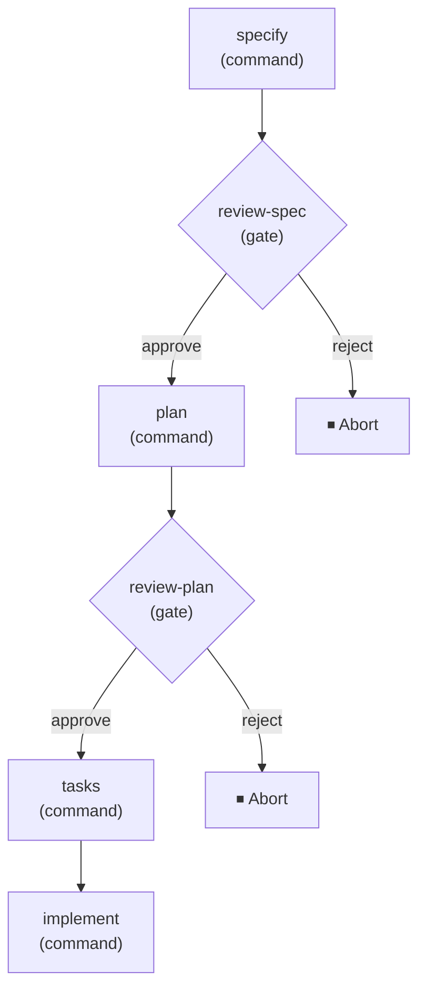

# Spec Kit, Part 9: Workflows — KDD in Motion

*The ninth entry in a series exploring [Spec Kit](https://github.com/github/spec-kit) and what it can do for spec-driven development.*

I have now ended three posts with the same IOU. Part 6 closed on "the automation machinery that turns a process into a run — KDD in motion." Part 8 signed off with "Next time: workflows — KDD in motion." Each time I deferred it because there was a more foundational thing to cover first: what the process *is*, how it becomes a kit of processes, how those processes are shared and found. All of that is prologue to the question a practitioner eventually asks out loud — *do I really have to type these nine commands by hand every time?* — and the answer is a **workflow**. This is the post where I finally cash the check.

The reason it was worth waiting for is that a workflow is not a macro. It would have been easy to ship "record the nine commands, replay them," and that would have been useless the first time a spec came back wrong and you wanted to stop and look before planning. A real process has branches, loops, points where a human has to weigh in, and steps that can fail and need a second try. A workflow is the layer that encodes *all* of that — the sequence, the conditionals, the human checkpoints, the state you resume from — so that a process you designed can be run, paused, and resumed as one repeatable thing.

## What a workflow is for

Every layer in this series has been about a process you do not have to run by hand yet. Part 5 walked the reference sequence command by command; Parts 2 and 3 showed how extensions and presets reshape which commands exist and how they behave; Part 6 argued that you can stand up whole *new* processes. But in every one of those posts, "running" the process still meant a person sitting at a prompt, typing `speckit.specify`, reading the result, deciding whether to continue, typing `speckit.plan`, and so on. That is fine when you are exploring. It does not scale to "run this exact process, the same way, fifty times, or on a schedule, or in CI."

A **workflow** is how you promote a process from something you perform to something you *invoke*. It chains commands, prompts, shell steps, and human checkpoints into a repeatable sequence — with conditional logic, loops, fan-out/fan-in, and the ability to pause and resume from the exact point of interruption. That last clause is the one that separates it from a shell script: a workflow is stateful. It knows where it stopped and can be picked back up, which is what makes a human checkpoint in the middle of an otherwise automated run actually practical.

The cleanest way I have found to hold it: extensions and presets decide *what* the process is; a workflow decides *how it runs without you standing over it*.

## A workflow is a graph of steps

A workflow is a YAML file, and the whole of it is a list of **steps** plus the metadata to run them. Here is the built-in **Full SDD Cycle** workflow that ships with Spec Kit — the reference sequence from Part 5, wired up to run on its own:

```yaml
schema_version: "1.0"
workflow:
  id: "speckit"
  name: "Full SDD Cycle"
  version: "1.0.0"
  author: "GitHub"
  description: "Runs specify → plan → tasks → implement with review gates"

requires:
  speckit_version: ">=0.7.2"
  integrations:
    any: ["copilot", "claude", "gemini"]

inputs:
  spec:
    type: string
    required: true
    prompt: "Describe what you want to build"
  integration:
    type: string
    default: "copilot"
  scope:
    type: string
    default: "full"
    enum: ["full", "backend-only", "frontend-only"]

steps:
  - id: specify
    command: speckit.specify
    integration: "{{ inputs.integration }}"
    input:
      args: "{{ inputs.spec }}"

  - id: review-spec
    type: gate
    message: "Review the generated spec before planning."
    options: [approve, reject]
    on_reject: abort

  - id: plan
    command: speckit.plan
    integration: "{{ inputs.integration }}"
    input:
      args: "{{ inputs.spec }}"

  - id: review-plan
    type: gate
    message: "Review the plan before generating tasks."
    options: [approve, reject]
    on_reject: abort

  - id: tasks
    command: speckit.tasks
    integration: "{{ inputs.integration }}"
    input:
      args: "{{ inputs.spec }}"

  - id: implement
    command: speckit.implement
    integration: "{{ inputs.integration }}"
    input:
      args: "{{ inputs.spec }}"
```

Read past the syntax and the shape is a directed graph. The `command` steps are the same `speckit.*` verbs Part 5 dissected — here they are nodes rather than things you type. Between them sit two `gate` steps, and those are the whole reason this is a workflow and not a script: the run does not barrel from spec to plan to code. It stops, twice, and asks a human to look. That is the execution flow it describes:



I want to flag the `integration:` field, because it is a quiet callback to Part 4. Each command step names the agent it should run through, and `"{{ inputs.integration }}"` means the *same* workflow runs on Copilot, Claude, or Gemini depending on one input. The workflow is written in Spec Kit's neutral vocabulary; the integration translates each step into the agent's dialect at run time. Every layer in this series really does keep showing up in the next.

A full catalog of the step types is worth having in view, because the graph can be much more than a straight line:

| Type | Purpose |
| --- | --- |
| `command` | Invoke a Spec Kit command (e.g., `speckit.plan`) |
| `prompt` | Send an arbitrary prompt to the AI coding agent |
| `shell` | Execute a shell command and capture output |
| `init` | Bootstrap a project (like `specify init`) |
| `gate` | Pause for human approval before continuing |
| `if` / `switch` | Conditional branching and multi-branch dispatch |
| `while` / `do-while` | Loop while a condition holds |
| `fan-out` / `fan-in` | Dispatch a step per item, then aggregate the results |

That is enough vocabulary to encode a real process: branch on whether tests passed, loop until a checklist is clean, fan a review step out across every changed module and gather the verdicts back in. I am deliberately *not* going deep on authoring these here — that is next post's job. For today the point is only that the building block of a workflow is the step, and there is a rich enough set of them that "the process" can have genuine structure.

## Gates: the human is a first-class step

The gate is my favorite thing in the model, because it takes the honesty the whole series keeps circling back to and bakes it into the runtime. Automation's failure mode is that it removes the human from the one place a human was actually adding judgment. A `gate` step refuses to do that: it is an explicit, declared pause where the run stops and waits for a person to approve or reject before anything downstream happens.

Mechanically, hitting a gate does not block a terminal forever. The run **pauses** — it persists its state and exits — and you resume it deliberately once you have looked:

```bash
specify workflow run speckit -i spec="Build a kanban board with drag-and-drop tasks"
# ... runs `specify`, then pauses at review-spec ...
specify workflow resume <run_id>
```

Because the pause is a real persisted state and not a held-open process, the review can take five minutes or five hours, happen on another machine, or be a different person than the one who kicked off the run. That is a much stronger guarantee than "the script prompted y/n and I hit enter without reading." The workflow encodes *where* judgment is required and then genuinely stops there.

## Running, pausing, resuming — the state is the feature

You run a workflow by source — a catalog ID, a URL, or a local file:

```bash
specify workflow run speckit -i spec="..." -i scope=full
```

Inputs the workflow declares are supplied with `-i key=value` or prompted for interactively, and they are coerced to their declared types (`"42"` becomes a number, `"true"` a boolean). Every run gets a unique `run_id` and its own state directory at `.specify/workflows/runs/<run_id>/`, holding three files: `state.json` (where the run is), `inputs.json` (the resolved inputs), and `log.jsonl` (a step-by-step execution log). Run states move through `created`, `running`, `paused`, `completed`, `failed`, and `aborted`, and `specify workflow status` shows you one run or lists them all.

That state directory is not an implementation detail — it is the whole reason resume works, for gates *and* for failures:

```bash
specify workflow resume <run_id> --input cmd="exit 0"
```

On resume, any `--input` you supply is merged over the run's stored inputs, re-validated, and the blocked step is re-run with the corrected values. So a run that failed on a bad shell command does not start over from `specify` — you fix the input and continue from exactly the step that broke. A process that can only run start-to-finish is fragile; one that check-points every step and resumes from the failure is something you can actually depend on. And because each run is independent, you can run the same workflow many times over — every invocation gets its own ID and its own state, so parallel or repeated runs never step on each other.

For scripting all of this, `--json` makes the run machine-readable: the outcome is printed as a single JSON object on stdout while any step output is redirected to stderr, so a wrapping tool can read `{ "run_id": ..., "status": "paused", "current_step_id": "review" }` cleanly and decide what to do next. That is the seam where a workflow stops being something a person runs and becomes something *another system* runs — CI, a scheduler, a bot.

## The shell step, and the trust boundary again

One step type earns a warning, and it is the same trust boundary Parts 7 and 8 kept running into from the catalog side. A `shell` step runs a local command with **your** privileges. There is no sandbox. The `requires:` block at the top of the workflow — spec-kit version, available integrations — is an *advisory pre-condition*, not a runtime gate; it checks that the workflow *can* run, not that it is *safe* to. There is deliberately no `requires.permissions` capability list, because a permissions list would imply a sandbox that does not exist, and Spec Kit would rather reject the field than lie about enforcing it.

The maintainers do not audit workflow code any more than they audit extension code — a catalog entry being `verified` means the *entry* is well-formed, not that its `shell` steps are harmless. So the same discipline applies: read a downloaded workflow's source before you run it, and put a `gate` step in front of anything destructive so a human has to approve before it fires. The gate is not only an editorial checkpoint for reviewing a spec; it is also the safety valve you place ahead of a command you would not want to run unattended. The model gives you the tools to be careful and declines to pretend it is being careful for you — which, by now, is the most Spec Kit design decision there is.

## Why this is KDD in motion

Back in Part 6 I floated **Kit-Driven Development** as the honest name for what you are doing once you stop consuming Spec Kit's one process and start assembling your own — tailoring the central process, standing up new ones, composing the set. Everything up to now has been KDD at rest: a process, described, shared, findable. A workflow is that same process *in motion*. It is the artifact that takes a process you assembled out of the kit and makes it a thing that runs — with its judgment points intact, its failures recoverable, its whole shape captured in a file you can version, share through a catalog, and hand to CI.

That is why the automation layer had to come last rather than first. You cannot meaningfully automate a process until you have one worth automating, and the previous eight posts were all about earning one: the reference sequence, the primitives that reshape it, the catalog that shares it. The workflow is where all of that stops being potential and starts being a run.

## Why I like this design

What I appreciate is that a workflow did not require inventing a workflow *engine* bolted onto the side of Spec Kit. It reuses everything already in the box. Its steps are the `speckit.*` commands from the core process and the commands extensions and presets contribute. Its `integration:` field is the Part 4 translator. Its distribution — `search`, `add`, `info`, catalogs resolved in priority order — is the exact same catalog machinery from Part 7, just pointed at a different component type. A workflow is not a new subsystem; it is the existing primitives arranged into a runnable graph, which is the same "compose, don't accrete" instinct I keep pointing at every time I like something here.

And it keeps faith with the human. The easy version of automation is the one that quietly cuts people out; the gate step makes the human a declared, first-class node in the graph, and the persisted-resume model makes stopping to think cost nothing. A process you can run unattended *and* pause for judgment at exactly the spots you chose is a much more honest kind of automation than "fire and hope."

There is one piece I have kept holding at arm's length even here. A workflow is a graph of steps, and I have leaned on the built-in step types — `command`, `gate`, `shell`, the control-flow ones — as if the set were fixed. It is not. Steps are their own primitive, with their own catalog, that you can author and share the same way you author an extension. That is the last building block the series has not opened up, and it is where I am going next: **steps** — writing your own, so the graph can do things the built-in vocabulary never anticipated. If there is a particular workflow you want me to build and walk through, or a step type you wish existed, send an email to blog (at) manorrock.com.

---

*Further reading: the [Spec Kit Workflows reference](https://github.com/github/spec-kit/blob/main/docs/reference/workflows.md), [What is Spec-Driven Development?](https://github.com/github/spec-kit/blob/main/docs/concepts/sdd.md), [Part 8: A Field Guide to the Community](../08/spec_kit_field_guide.html), [Part 7: Catalogs](../07/spec_kit_catalogs.html), [Part 6: From Spec to Kit](../06/spec_kit_kit.html), [Part 5: The Spec-Driven Process](../02/spec_kit_process.html), [Part 4: Integrations](../01/spec_kit_integrations.html), [Part 3: Presets](../../06/30/spec_kit_presets.html), [Part 2: Extensions](../../06/29/spec_kit_extensions.html), and [Part 1: Bundles](../../06/26/spec_kit_bundles.html).*
