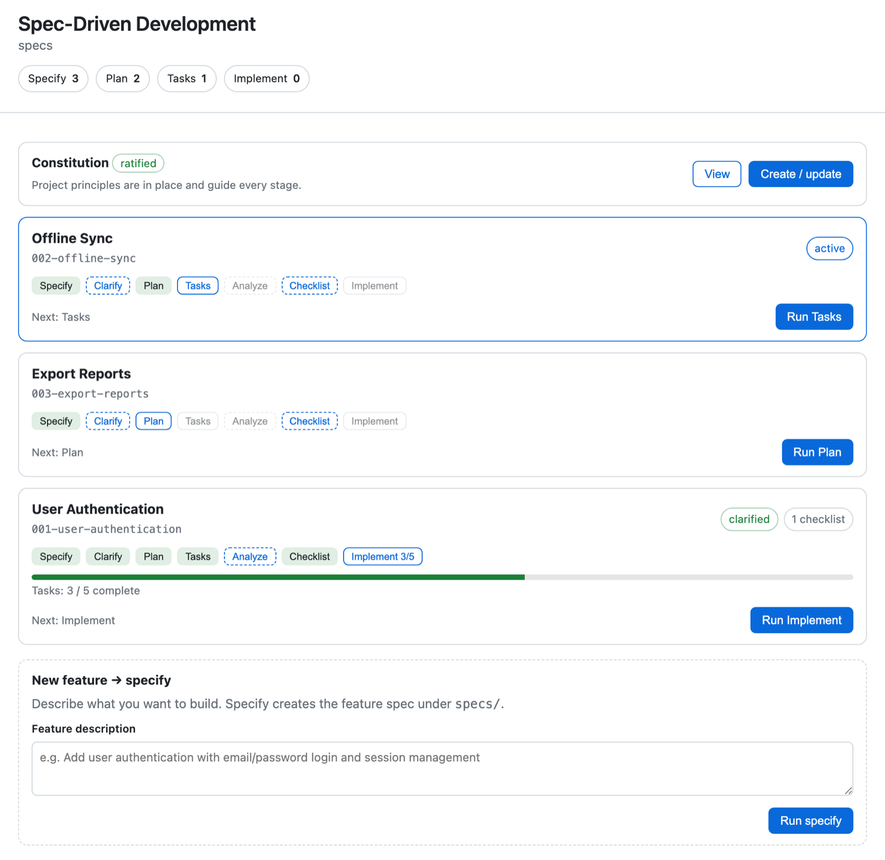
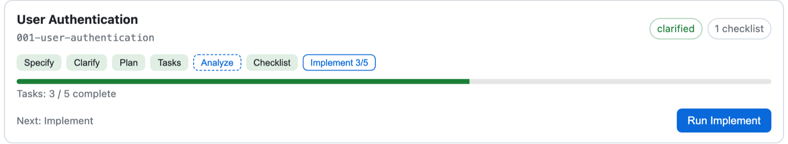

# Spec Kit with Copilot, Part 3: The SDD Canvas

*The third entry in a dedicated series about the Copilot-specific pieces around [Spec Kit](https://github.com/github/spec-kit), following [Part 1: Driving the Kit Without Leaving the Agent](../../07/24/spec_kit_copilot.html) and [Part 2: Sub-Agents](../25/spec_kit_copilot_sub_agents.html).*

Part 2 was about distributing work. The `copilot-sub-agents` preset can give independent research, validation, and implementation tasks their own focused contexts. That helps the work move, but it also creates a new need: a way to see where the shared process stands as those separate efforts finish.

A chat transcript is good at showing the current conversation. It is less good at answering worktree-level questions at a glance. Which feature is active? How far has it moved? Is its plan stale? Has a checklist been created? How many implementation tasks are complete? What should happen next?

The SDD Canvas exists to answer those questions visually. It does not replace the Spec Kit skills or the Markdown artifacts they create. It turns their current state into a dashboard: one place to see the constitution, the feature artifacts visible in the current worktree, the full SDD lifecycle, the artifacts behind each stage, and the next action that makes sense. Sub-agents distribute the work; the SDD Canvas makes that work visible.

## Open the visual surface

Install the canvas plugin from the Spec Kit Copilot marketplace:

```bash
copilot plugin marketplace add github/spec-kit-copilot
copilot plugin install spec-kit-copilot-sdd@spec-kit-marketplace
```

Then ask Copilot to **Open Spec-Driven Development**. This is a Copilot App canvas, so it opens in the side panel rather than printing another report into the terminal. There is no slash command or menu entry to memorize. Installing the plugin makes the canvas available; asking for it opens the visual surface beside the conversation.

If the repository is not ready for Spec Kit in Copilot skills mode, setup is the first view. The canvas does not show a collection of disabled feature controls and leave the user to diagnose them. It presents one setup action. The agent initializes Spec Kit, reloads the skills, and the panel changes to the working dashboard when the project is ready.

That transition is important to the experience. Setup is not a separate prerequisite page the user has to find before the product becomes useful. It is the first state of the product.

The [`sdd-canvas` README](https://github.com/github/spec-kit-copilot/blob/0e7999502bf48785e9164ca3021c26e7d696e731/plugins/spec-kit-copilot-sdd/extensions/sdd-canvas/README.md) documents the canvas shown here. The [repository describes these optional App canvases](https://github.com/github/spec-kit-copilot/blob/0e7999502bf48785e9164ca3021c26e7d696e731/README.md#canvases) as using the **experimental Canvas SDK**, so the visual surface should be understood as early product work even though the Spec Kit process underneath it is established.

## Read the worktree at a glance

Once setup is complete, the dashboard puts the current worktree in view:



The dashboard begins with a project-level view, not a single feature. At the top, four counters summarize how many features have reached the primary milestones: Specify, Plan, Tasks, and Implement. They do not claim every feature follows one shared percentage. They answer a more useful question: how much work has reached each durable point in the process?

Below that is the constitution. Its card shows whether the project principles are missing, still a template, or ratified. The constitution belongs above the feature list because it governs every feature. From the same card, the user can view it or create and update it.

Then come the feature cards. Each one shows:

- the feature title and directory slug;
- whether it is the active feature;
- the state of every SDD stage;
- clarification and checklist status;
- implementation task progress;
- the recommended next action.

That is the main value of the canvas. It turns a directory tree and several Markdown files into a readable worktree map without hiding the files themselves. The three cards in the overview should not be read as three features being implemented concurrently in one checkout. They show the feature artifacts visible in this worktree. One card is active; the others provide project context.

From that overview, each feature card carries the full visual lifecycle:

```text
specify → clarify → plan → tasks → analyze → checklist → implement
```

The primary path remains the same one described in the [agent-agnostic SDD process](../../07/02/spec_kit_process.html):

```text
specify → plan → tasks → implement
```

Clarify, Analyze, and Checklist remain visible as quality gates instead of disappearing into an advanced view. That matters because optional should not mean invisible. The canvas keeps them in the flow while still showing the primary artifact sequence clearly.

The stage pills communicate more than complete or incomplete. A stage can be done, next, available, stale, or pending. Together those states let the user read a feature card as a sentence: the specification and plan exist; Tasks is next; Analyze and Implement are waiting; Clarify and Checklist remain available if this feature needs another quality pass.

The large action at the bottom of the card repeats the recommended next stage. The user does not need to remember the command order or infer it from filenames. The current state points toward the next sensible move.

The order is also guarded. Plan needs a specification. Tasks needs a plan. Analyze and Implement need tasks. Clarify and Checklist become available once a specification exists. If the user tries to skip a required artifact, the canvas explains what is missing instead of launching a command that cannot succeed.

Analyze gets a particularly honest visual treatment. It produces a report in the conversation rather than a durable feature artifact, so the canvas makes it available after Tasks but does not invent a permanent completed state for it. The interface reflects what actually exists.

Feature selection is part of that visual reading. A worktree can contain several feature directories at different points in the lifecycle. The canvas shows them together, but it does not make them visually equal.

The active feature is marked with an **active** badge and appears first. Other features follow in recent-activity order. That gives the eye an immediate starting point while preserving the wider project context. Selecting a stage from the active feature card keeps the action attached to that feature. The user is not clicking a generic Plan button and hoping the agent infers the same target from the repository; the card is both the visible state and the visible scope of the action.

Creating a feature has its own entry point at the bottom of the dashboard. The **New feature → specify** form asks for the feature description, then lets Spec Kit create the feature and its specification. When the new feature appears as a card, it joins the same visual lifecycle as every other feature. In practice, this is how a worktree begins its next active feature, not how it starts another concurrent implementation beside the current one.

This is a simple interaction, but it keeps an important distinction clear: new work begins with a description; existing work continues from the active feature and stage.

The practical operating model is **one active feature per worktree**. Specification artifacts for several features may be visible in one checkout, especially after earlier work has merged, but implementation changes the shared source tree. Trying to implement several features concurrently in that same worktree invites overlapping edits, misleading task progress, and difficult reconciliation.

Parallel features should therefore get separate worktrees, sessions, and canvases. Each canvas shows the active feature plus the surrounding artifacts visible in its own checkout. The overview is useful as local project context, but it is not a portfolio dashboard and it does not aggregate or coordinate work happening in other worktrees.

## Stale looks different from missing

One of the best choices in the canvas is that an existing artifact is not automatically shown as complete.

Suppose a feature already has `spec.md`, `plan.md`, and `tasks.md`. If the specification changes afterward, the plan still exists. So do the tasks. A file browser can show all three files, but it cannot tell the user that the later two may no longer describe the current feature.

The canvas can.

When an upstream artifact changes, the affected downstream pill becomes **stale**. The feature card keeps the artifact visible but changes what the user sees as the next action. Run becomes Rerun. The state says, in effect, “this work exists, but it no longer lines up with what came before it.”

Rerunning Plan or Tasks requires explicit overwrite confirmation. The user sees that this is not a harmless first run, and the existing artifact remains available as context so still-valid work can be preserved.

This is where the visual surface adds something a command list cannot. It makes the relationships between artifacts visible. As I wrote in the [artifact introspection post](../23/spec_kit_artifacts.html), knowing that an artifact exists is not enough; you need to understand how it relates to the process that produced it. In the canvas, stale is that relationship made visible.

That visible status still has to lead back to evidence. A dashboard becomes dangerous when its colored states replace inspection, so the SDD Canvas makes the important artifacts directly viewable.

The constitution, `spec.md`, `plan.md`, and `tasks.md` open as rendered Markdown in a dedicated full-width view. Headings, lists, code blocks, blockquotes, and tables become readable without leaving the canvas. A Back to dashboard control returns to the project overview.

That makes the movement between status and evidence immediate:

- If the constitution says ratified, open it and read the principles.
- If Plan says done, open the plan and inspect the design.
- If Tasks says done, open the task breakdown.
- If implementation says three of five, open `tasks.md` and see which three.

The preview is not a second representation that has to be kept in sync manually. It is a view of the Markdown artifact itself. The specification preview also supports targeted `[NEEDS CLARIFICATION: ...]` markers: the user can answer a specific question from the artifact view, and the answer is applied through the existing Clarify skill. It is a useful part of the preview experience, but the broader point is that the canvas keeps action close to the evidence that motivated it.

## Watch implementation move

Implementation progress gets its own visual language:



The card shows **Implement 3/5**, a progress bar, the text **Tasks: 3 / 5 complete**, and Implement as the next action. Those are four ways of reinforcing the same state without asking the user to open `tasks.md` every time a task is checked off.

The progress still comes from `tasks.md`, not a separate status the user has to maintain. As the implementation skill checks tasks off, the visual state advances. When all tasks are complete, the feature reaches the final milestone.

This is especially useful when Part 2's sub-agents are involved. Several parallel-safe tasks may finish in separate contexts, but the feature card brings their shared progress back into one place. It does not decide whether those tasks were correctly marked parallel or whether their changes are good. It lets the user see what the artifact says happened.

That progress would be much less useful if the canvas were a static report generated when it opened.

As the agent creates a specification, writes a plan, regenerates tasks, or checks off implementation work, the panel updates. A new feature card appears. A stale pill becomes current. A progress bar moves. The user can keep the project map open beside the conversation instead of repeatedly closing it, rerunning a status command, and rebuilding the mental model.

That live quality is central to why this belongs in a canvas. The value is not merely prettier output. It is persistent visual orientation while the underlying work changes.

The user can drive the visible controls directly: create or update the constitution, describe a new feature, choose a stage, add guidance, confirm a rerun, open an artifact, or answer a question in the spec. Natural-language interaction remains available too. Asking Copilot to inspect or advance the process reaches the same canvas through its documented `list_features`, `setup_sdd`, `run_stage`, and `clarify_item` actions.

Those two paths return to the same visual state. Whether the user clicks Run Plan or asks Copilot to plan the active feature, the existing Spec Kit skill performs the work and the dashboard shows the result. The canvas does not invent another SDD engine behind the panel.

## What the visual surface does not promise

The dashboard makes state easier to understand. It does not make the underlying work automatically correct.

It does not remove artifact dependencies. It makes stale downstream work visible and prevents invalid ordering, but someone still has to decide whether a revised plan faithfully reflects the revised specification.

It does not make parallelism safe or coordinate worktrees. The sub-agent preset can distribute independent tasks inside the active feature, but a wrongly marked `[P]` task can still collide with another change. Parallel feature branches need their own sessions and canvases; this dashboard reports only the state visible in the checkout where it is open.

It does not replace human review. A green pill means the canvas found current work or a durable trace. It does not mean the specification is wise, the plan is secure, the checklist is sufficient, or the implementation should merge.

And it does not replace Markdown with proprietary dashboard state. Close the panel and the constitution, specification, plan, tasks, checklists, and checked boxes remain ordinary repository artifacts. Open it again and the visual state returns from those files.

Those boundaries make the canvas more trustworthy, not less capable. It shows the process without claiming to judge the work for you.

## Why I like this design

The SDD Canvas gives Spec Kit something artifact-driven processes often lack: a place to stand.

Without it, every artifact is still available and every command still works, but orientation is assembled manually. You remember which feature is active. You inspect timestamps or reread files to notice drift. You open `tasks.md` to estimate progress. You reconstruct the project from several correct but separate pieces.

The canvas turns those pieces into a visual narrative. Start with setup. See the constitution. Scan the project funnel. Find the active feature. Read its stage pills from left to right. Notice stale work. Open the artifact behind a status. Watch implementation move.

None of that replaces the process. It makes the process easier to inhabit.

That is the connection to Part 2. Sub-agents can spread independent tasks across more contexts inside one feature. Separate worktrees isolate different features. The SDD Canvas provides one legible account of one worktree's process without pretending to be a global coordinator.

The best visual tools do not hide the underlying system. They make its relationships visible.

If you try the SDD Canvas, I would like to hear which part of the project became easier to see. Send an email to blog (at) manorrock.com.

---

*Further reading: [Part 2: Sub-Agents](../25/spec_kit_copilot_sub_agents.html), [Part 1: Driving the Kit Without Leaving the Agent](../../07/24/spec_kit_copilot.html), the pinned [`sdd-canvas` README](https://github.com/github/spec-kit-copilot/blob/0e7999502bf48785e9164ca3021c26e7d696e731/plugins/spec-kit-copilot-sdd/extensions/sdd-canvas/README.md), [Spec Kit, Part 5: The Spec-Driven Process](../../07/02/spec_kit_process.html), and [Spec Kit, Part 14: Artifacts](../23/spec_kit_artifacts.html).*
