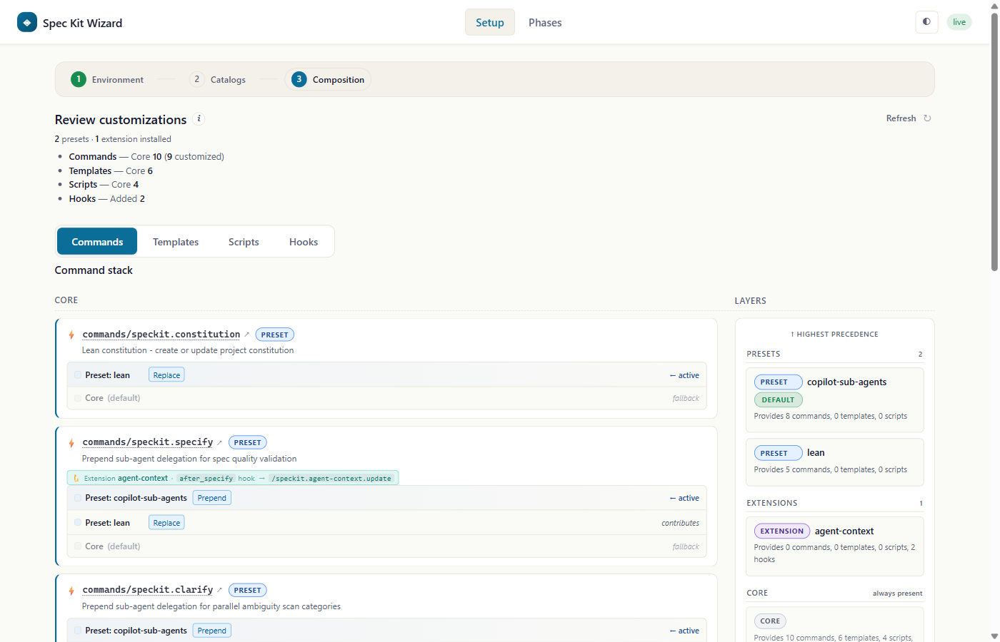
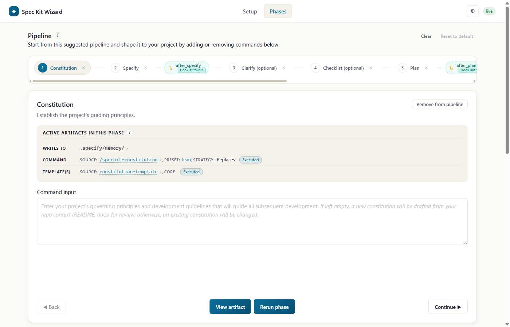

# Spec Kit with Copilot, Part 4: The Spec Kit Wizard

*The fourth and final entry in a dedicated series about the Copilot-specific pieces around [Spec Kit](https://github.com/github/spec-kit), following [Part 1: Driving the Kit Without Leaving the Agent](../../07/24/spec_kit_copilot.html), [Part 2: Sub-Agents](../../09/25/spec_kit_copilot_sub_agents.html), and [Part 3: The SDD Canvas](../../09/30/spec_kit_copilot_sdd_canvas.html).*

Part 1 brought Spec Kit's management surface into Copilot. Instead of leaving the agent to install an extension, add a preset, initialize a project, or upgrade the CLI, Copilot could use the `spec-kit-copilot` skills to drive the real `specify` commands on the user's behalf.

Part 2 showed that the resulting process did not have to stay inside one context. A Copilot-specific preset could identify independent research, validation, and implementation work, delegate it to sub-agents, and bring the results back into the same Spec Kit artifacts.

Part 3 made one worktree's SDD state visible. The SDD Canvas could show which feature was active, which artifacts existed, what had become stale, and where implementation stood without replacing the Markdown files underneath it.

The [Spec Kit Wizard](https://github.com/github/spec-kit-copilot/tree/0e7999502bf48785e9164ca3021c26e7d696e731/plugins/spec-kit-copilot-wizard) is where those ideas meet. It is not simply another process dashboard. It is the control plane around the process: a guided place to prepare the environment, discover the kit's installable pieces, inspect how those pieces compose, turn that composition into an executable pipeline, and then run it through the same Copilot skills Part 1 introduced.

That makes it the right place to finish this four-part arc.

## Open the control plane

The Wizard is an optional GitHub Copilot App canvas plugin. The core skills still need to be present because the Wizard delegates real work to them:

```bash
copilot plugin marketplace add github/spec-kit-copilot
copilot plugin install spec-kit-copilot@spec-kit-marketplace
copilot plugin install spec-kit-copilot-wizard@spec-kit-marketplace
```

Then ask Copilot to **Open the Spec Kit Wizard**. Installing the plugin registers the canvas; asking for it opens the side panel. There is no separate slash command or menu entry to memorize.

The repository describes its optional canvases as riding the **experimental Canvas SDK**, so the visual surface should be treated as active product exploration. The Spec Kit CLI, generated skills, presets, extensions, and artifacts beneath it are the real system. The Wizard is a guided way to see and operate that system.

Its first useful choice is not a workflow phase. It is **Environment**.


The page checks the path from "canvas opened" to "project can actually run Spec Kit":

- the core Spec Kit Copilot plugin is installed;
- the `specify` CLI is available;
- the project has been initialized for Spec Kit and Copilot skills;
- the default presets are installed;
- the current Copilot session has reloaded the scaffolded skills.

Each row is both status and action. If the CLI is missing, setup can invoke the existing CLI setup skill. If the project is not initialized, it can invoke the init skill. If the files exist but the current session has not noticed the newly generated skills, it can reload the skill registry. The Wizard does not invent a second setup mechanism. It makes the same mechanisms visible and puts their next action beside their state.

That distinction is the connection back to Part 1. Part 1 made it possible to say "initialize this project" and let Copilot drive `specify init`. The Wizard turns that invisible management conversation into an inspectable checklist. You can still ask Copilot to do the work in natural language; now you can also see why the environment is or is not ready.

## Discover what can change the process

Once the environment is ready, the second surface is **Catalogs**.

The Wizard groups the kit's installable units the same way Spec Kit does:

- **presets** customize existing commands, templates, and scripts;
- **extensions** add capabilities, including new commands, templates, scripts, and hooks;
- **bundles** package a curated set of extensions and presets.

It currently browses the built-in and community Spec Kit catalogs plus the Copilot-specific preset catalog. That last source is where entries such as `copilot-sub-agents` from Part 2 and the [Copilot Assess Clarifying Questions preset](https://github.com/github/spec-kit-copilot/blob/0e7999502bf48785e9164ca3021c26e7d696e731/spec-kit-presets/copilot-assess-ask-questions/README.md) appear. The latter wraps the five `assess` stages with Copilot's interactive `ask_user` questions. The Wizard can help discover and install it; it does not need to reproduce the preset's complete assessment flow to make that customization available.

The same principle applies to the Idea Assessment and Bug Fix experiences. Their focused canvases remain independently installable Copilot plugins. In the Wizard, the useful objects are the underlying Spec Kit extensions and the commands they contribute. Add the `assess` or `bug` extension, and the Wizard can bring those commands into the composition and help place their runnable phases. If a user wants the purpose-built [Idea Assessment Canvas](https://github.com/github/spec-kit-copilot/blob/0e7999502bf48785e9164ca3021c26e7d696e731/plugins/spec-kit-copilot-assess/extensions/assess-canvas/README.md) or [Bug Fix Canvas](https://github.com/github/spec-kit-copilot/blob/0e7999502bf48785e9164ca3021c26e7d696e731/plugins/spec-kit-copilot-bugfix/extensions/bugfix-canvas/README.md), that remains a separate presentation choice, not a hidden mode inside this Wizard.

Installation still belongs to Spec Kit. Clicking **Install** or asking Copilot to add a preset or extension routes through the core skills, which call the real `specify preset add` or `specify extension add` behavior. Newly scaffolded commands still become Copilot skills, and the current session still has to load those skills before it can invoke them. The Wizard can request that reload directly, but it has not created another package manager or another registry format.

There is an important scope boundary here. The current catalog page is a curated view of the built-in, Copilot, and community sources documented by the plugin. It is not a universal audit of every third-party catalog a user may have registered elsewhere through the CLI. Discovery becomes easier; trust does not become automatic.

## See what the project actually assembled

Installing pieces is only the beginning. A list of installed names does not answer the harder question: *what does this project now run?*

That is the job of **Composition**.



The screenshot shows why this is more than an installed-items page. The left side is organized by artifact kind: commands, templates, scripts, and hooks. Each command row shows the layers that contribute to it and the strategy used to combine them. The right side shows the installed layers in precedence order.

For `speckit.specify`, for example, core remains the fallback, one preset may replace the command, another may prepend guidance, and an extension may attach a hook. Those are not four unrelated files. Together they are the command Copilot will actually receive.

This is the visual counterpart to the [agent-agnostic articles on presets](../../06/30/spec_kit_presets.html), [extensions](../../06/29/spec_kit_extensions.html), and [workflow overlays and slots](../../09/24/spec_kit_workflow_overlays_and_slots.html). Those posts described composition as a mechanism. The Wizard lets a user inspect the resolved result before running it.

It also gives Part 2 a concrete place in the stack. The `copilot-sub-agents` preset is no longer merely an installation fact. Its prepend strategy is visible beside the core command it modifies. The user can see that delegation guidance layers onto the command rather than replacing the entire SDD process.

The same is true for the Ask Questions preset. After the `assess` extension and preset are installed, the Composition page can show the preset wrapping the assessment commands contributed by the extension. That is a more useful explanation than "both are installed." It shows the relationship.

But composition visibility is not code review. A row can tell you which third-party layer won, which strategy it declared, and what artifacts it contributes. It cannot prove that the layer is safe, correct, well maintained, or appropriate for your repository. Installation and execution inherit Spec Kit's trust model: review the source and understand what you are choosing to run.

## Turn composition into phases

A composed artifact stack still does not necessarily reveal an obvious user journey. Core SDD has a familiar spine, but an extension can add commands before it, after it, between stages, or as a separate process entirely.

The Wizard therefore distinguishes **what is installed** from **what should be run, and in what order**.

It can ask Copilot to infer a pipeline from the available command artifacts and the documentation that accompanies them. The result includes an ordered pipeline, commands the agent could not confidently place, and a rationale for the proposed shape. A discovery process such as `assess` may form a standalone intake-to-decision pipeline. An extension that augments SDD may instead insert commands around the canonical constitution, specify, plan, tasks, and implement spine.

That inference is guidance, not authority. Commands that cannot be placed confidently remain unplaced rather than being forced into a plausible-looking order. The user can add, remove, or reorder manually runnable phases in the visual pipeline. Hooks remain attached to the events that own them instead of pretending to be ordinary buttons the user must remember to click.

This is where the Wizard earns the word *wizard*. It does not merely report state after the user already knows the process. It helps translate a set of composable parts into the sequence the project can actually follow, while keeping the user able to inspect and reshape the result.

## Run the real phases

The fourth surface is **Phases**, the executable view of that pipeline.



Selecting a phase shows the active artifacts behind it: where the phase writes, which composed command will run, which templates support it, and which hooks belong to the surrounding lifecycle. The user can provide phase input, run or rerun the phase, inspect an existing artifact, and move through the pipeline.

The work still happens in Copilot chat through the matching `speckit-*` skill. That matters for two reasons.

First, the skill keeps its normal guardrails and interaction model. If Specify needs a slug, Clarify needs an answer, or a phase encounters a validation failure, the conversation remains the place where that reasoning happens. The canvas launches and tracks the work; it does not hide the agent behind a progress animation.

Second, the output remains ordinary Spec Kit output. Constitutions, specifications, plans, tasks, checklists, analyses, and implementation changes still live where the CLI and skills put them. The Wizard does not create a second workflow engine with its own proprietary artifact set.

After a tracked phase finishes, Copilot can report a terminal status back to the Wizard. On success it can also report which of the phase's expected templates, scripts, and hooks were actually used. That is why the active-artifact view can say more than "a button was clicked." It can connect the visible phase to evidence about what the agent ran.

That report is still a report. A completed status does not certify the quality of the specification, the security of the plan, or the correctness of the implementation. As in Part 3, visual state improves orientation; it does not remove the need to read the artifacts and review the work.

## Clicks and conversation are the same control surface

The Wizard's most Copilot-specific idea is **dual control**.

You can click **Install** on a preset, or ask Copilot to install it. You can click **Run phase**, or ask Copilot to run Plan. You can move to a catalog in the UI, or ask the agent to show it. You can click **Reload skills**, or ask Copilot to refresh what the session can see.

The [current Wizard README](https://github.com/github/spec-kit-copilot/blob/0e7999502bf48785e9164ca3021c26e7d696e731/plugins/spec-kit-copilot-wizard/extensions/speckit-wizard-canvas/README.md#agent-callable-actions) documents **13 agent-callable actions**. They read less like an API when grouped by what a user can ask for:

- **Do work:** run a phase, add a preset, add an extension, add inferred commands to the pipeline, reload skills, or ask Copilot to diagnose an npm setup failure.
- **Navigate and explain:** show the preset, extension, or bundle catalog, or show the environment report.
- **Shape the process:** present the inferred pipeline built from the installed composition and its documentation.
- **Report what happened:** update a phase's terminal status and report which expected templates, scripts, and hooks were used.

Those actions are what let natural language and buttons converge on the same experience. The agent does not merely describe the panel, and the panel does not merely send opaque commands. Each can update the other.

This is also how the Wizard connects to Part 3 without replacing it. The SDD Canvas is a focused worktree dashboard: which features exist, what is stale, and what should happen next inside the core SDD lifecycle. The Wizard is broader and earlier in the chain: is the environment ready, what can be installed, what did those choices compose, which phases are executable, and how do we launch them? One visualizes the active SDD work. The other assembles and operates the kit around it.

## When setup fails

A guided experience is only useful if it remains useful at the first failure.

On first open, the Wizard checks its workspace, dependencies, environment, and catalogs while keeping the canvas visible. If its small npm dependency cannot be installed because of a blocked registry, proxy, corporate certificate, timeout, or similar host problem, the setup experience does not collapse into a generic blank panel.

It offers two user-facing recovery paths:

- **Diagnose and fix with the agent** asks Copilot to inspect the local npm configuration, identify the likely registry, proxy, or certificate issue, propose a minimal change, retry, and refresh the environment.
- **Retry install** repeats the dependency installation after the user has corrected the environment.

The same principle applies to the rest of Environment. A missing CLI should lead to CLI setup. An uninitialized project should lead to initialization. Missing skills in the current session should lead to reload. Diagnosis stays attached to the failed prerequisite rather than sending the user away to reconstruct the boot sequence from logs.

That does not mean the Wizard silently rewrites machine configuration or makes an organization's network policy disappear. Copilot still needs the user to approve the relevant local change and, in some environments, to supply the approved registry or certificate details. Guided recovery narrows the problem; human judgment and local policy still decide the fix.

## Why I like this design

The Wizard is the synthesis of this series because it makes the whole stack legible without pretending the stack has become one product.

The `specify` CLI remains the manager. Skills remain the bridge into Copilot. Presets remain layers over existing artifacts. Extensions remain additions to the kit. Bundles remain curated packages. The SDD and assessment processes remain sequences of commands and repository artifacts. Focused canvases remain optional views.

The Wizard sits above those pieces and answers the questions that appear when composition succeeds:

```text
Is the environment ready?
What can I add?
What did I add?
How did it compose?
What can I run?
What happened when I ran it?
```

That is a control plane, not a replacement engine.

Part 1 removed the trip to the terminal to manage the kit. Part 2 let Copilot distribute carefully bounded work. Part 3 gave one worktree a visual account of its SDD state. Part 4 brings management, discovery, composition, execution, and diagnosis into one guided surface while preserving the real pieces underneath.

The four-part Copilot series ends there. Not because every useful canvas or preset has now been cataloged in its own article, but because the architectural arc is complete: Copilot can drive the kit, distribute parts of the work, show the process, and now help assemble the experience itself.

The best control planes do not make their underlying systems disappear. They make those systems understandable enough that you can choose what to run, see what it means, and know where your judgment is still required.

If you try the Spec Kit Wizard, I would like to hear which part of the kit became easier to understand and which part still felt hidden. Send an email to blog (at) manorrock.com.

---

*Further reading: [Part 1: Driving the Kit Without Leaving the Agent](../../07/24/spec_kit_copilot.html), [Part 2: Sub-Agents](../../09/25/spec_kit_copilot_sub_agents.html), [Part 3: The SDD Canvas](../../09/30/spec_kit_copilot_sdd_canvas.html), the pinned [Spec Kit Wizard README](https://github.com/github/spec-kit-copilot/blob/0e7999502bf48785e9164ca3021c26e7d696e731/plugins/spec-kit-copilot-wizard/extensions/speckit-wizard-canvas/README.md), its [plugin manifest](https://github.com/github/spec-kit-copilot/blob/0e7999502bf48785e9164ca3021c26e7d696e731/plugins/spec-kit-copilot-wizard/plugin.json), [Spec Kit, Part 2: Extensions](../../06/29/spec_kit_extensions.html), [Spec Kit, Part 3: Presets](../../06/30/spec_kit_presets.html), [Spec Kit, Part 5: The Spec-Driven Process](../../07/02/spec_kit_process.html), and [Spec Kit, Part 14: Artifacts](../../09/23/spec_kit_artifacts.html).*
