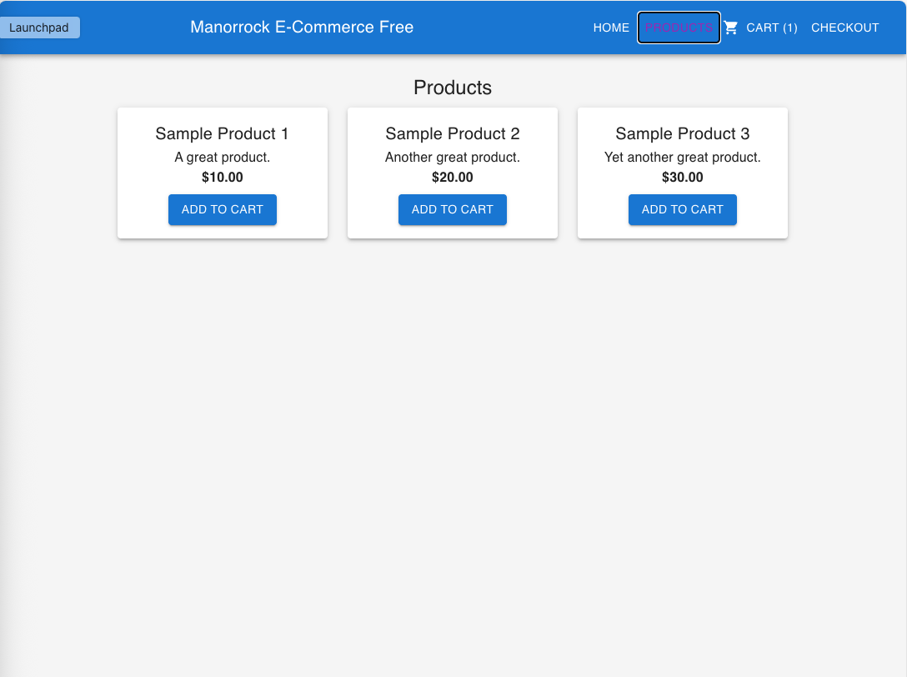
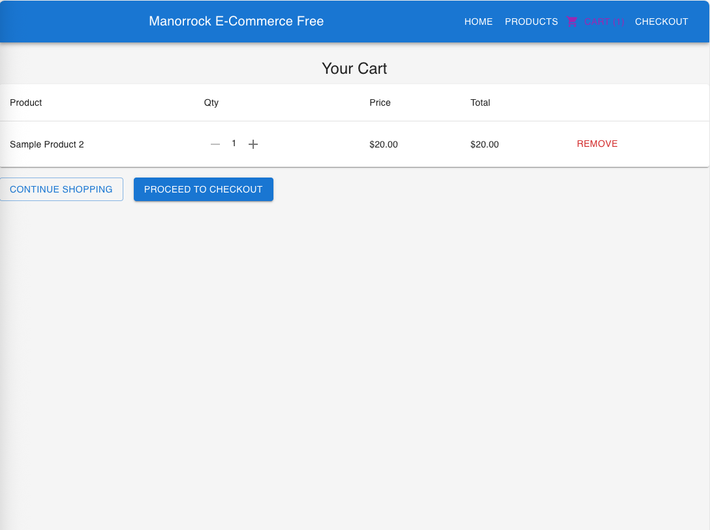

# Manorrock E-commerce Free

Manorrock E-commerce Free is a modern, zero-cost, open-source e-commerce platform designed for small businesses, hobbyists, and anyone who wants to sell online without the hassle or expense of proprietary solutions.

## Key Features
- Simple setup – get started in minutes
- Modern, responsive UI
- Customizable and developer-friendly
- Production-ready out of the box

## Live Demo
[Try the Demo](demo/)

## Get Started
[View on GitHub](https://github.com/manorrock/ecommerce)

## Screenshots

## Why Choose Manorrock E-commerce Free?
- Easy to deploy anywhere (static hosting, cloud, on-premises)

## Documentation
[Read the Docs](https://github.com/manorrock/ecommerce#readme)

## Need Help?
Questions? [Contact us](mailto:info@manorrock.com) or [open an issue](https://github.com/manorrock/ecommerce/issues).
