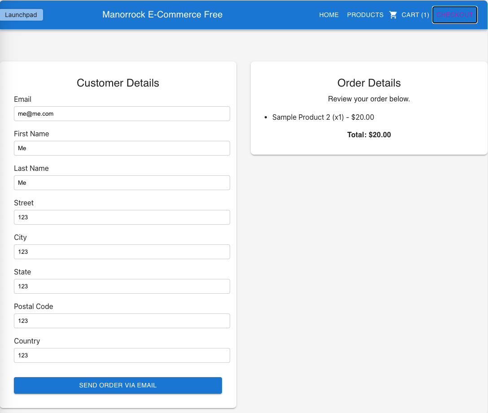

# Manorrock E-commerce Free

Manorrock E-commerce Free is a modern, zero-cost e-commerce platform designed for small businesses, hobbyists, and anyone who wants to sell online without the hassle or expense of proprietary solutions.

## Key Features
- Simple setup – get started in minutes
- Modern, responsive UI
- Customizable and developer-friendly
- Production-ready out of the box

## Live Demo
[Try the Demo](demo/)

## Get Started
[View on GitHub](https://github.com/manorrock/ecommerce)

## Screenshots

	

		
		
Product catalog

	

	

		
		
Shopping cart

	

	

		
		
Checkout page

	

## Why Choose Manorrock E-commerce Free?

- **Zero cost, zero hassle:** Get started instantly with no fees or hidden charges.
- **Modern, mobile-ready storefront:** Impress your customers with a beautiful, responsive design that works on any device.
- **Effortless product catalog:** Add and showcase your products with ease.
- **Simple shopping cart & order process:** Customers add items to their cart and, instead of paying online, submit their order via email—perfect for invoicing, custom payment, or offline fulfillment.
- **Deploy anywhere:** Easy to deploy anywhere (static hosting, cloud, on-premises)

## Documentation
[Read the Docs](https://github.com/manorrock/ecommerce#readme)

## Need Help?
Questions? [Contact us](mailto:info@manorrock.com) or [open an issue](https://github.com/manorrock/ecommerce/issues).

[Back to Manorrock E-commerce Product Line](../index.md)
